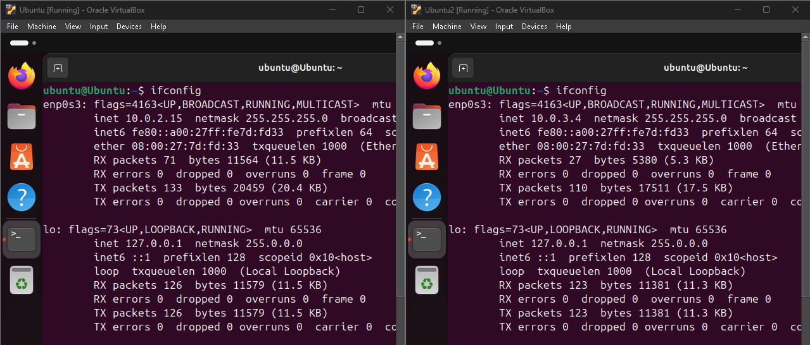
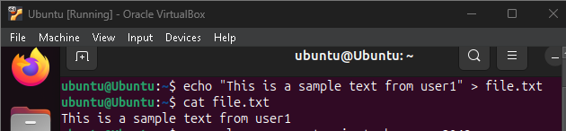
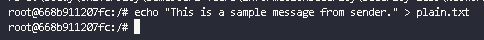

# Task 1: Transfer files between computers  
**Question 1**: 
Conduct transfering a single plaintext file between 2 computers, 
Using openssl to implementing measures manually to ensure file integerity and authenticity at sending side, 
then veryfing at receiving side. 

**Answer 1**:

***Step 1: Set up environment***

We have 2 linux user



User1 have ip 10.0.2.15
User2 have ip 10.0.3.4

Set up ssh for both user

```sh
sudo apt update
sudo apt install openssh-server
sudo systemctl start ssh
```

***Step 2: Create sample file in user1***

```sh
echo "This is a sample text from user1" > file.txt
```

Now we watch the file we have just created

```sh
cat file.txt
```



***Step 3: Ping 2 user to ensure they are connected***


***Step 4: Transfering a plaintext file between 2 user***

```sh
openssl genrsa -out private_key.pem 2048
openssl rsa -in private_key.pem -pubout -out public_key.pem
```



Calculate the hash of the file

```sh
openssl dgst -sha256 -out file.txt.sha256 file.txt
```

Create digital snature with private key

```sh
openssl dgst -sha256 -sign private_key.pem -out file.txt.sign file.txt
```

Transfer files to user2 with scp

```sh
scp file.txt file.txt.sha256 file.txt.sign public_key.pem ubuntu@10.0.3.4:/home/ubuntu
```

Verify from user2

```sh
openssl dgst -sha256 -verify public_key.pem -signature file.txt.sign file.txt
```

# Task 2: Transfering encrypted file and decrypt it with hybrid encryption. 
**Question 1**:
Conduct transfering a file (deliberately choosen by you) between 2 computers. 
The file is symmetrically encrypted/decrypted by exchanging secret key which is encrypted using RSA. 
All steps are made manually with openssl at the terminal of each computer.

**Answer 1**:

Create File in user1
```sh
echo "Sample text" > secret_file.txt
cat secret_file.txt
```

User1 Client
1 Encrypt file with secret key (AES)
```sh
openssl rand -base64 32 > secret_key.bin
openssl enc -aes-256-cbc -salt -pbkdf2 -in secret_file.txt -out secret_file.enc -pass file:./secret_key.bin
```
2 Encrypt secret key with RSA
```sh
openssl rsautl -encrypt -inkey public_key.pem -pubin -in secret_key.bin -out secret_key.enc
```
3. Send file
```sh
scp secret_file.enc secret_key.enc private_key.pem ubuntu@10.0.3.4:/home/ubuntu
```

Linh Client
4 Decrypt secret key
```sh
openssl pkeyutl -decrypt -inkey private_key.pem -in secret_key.enc -out secret_key.bin
```
5.Decrypt file with secret key
```sh
openssl enc -d -aes-256-cbc -salt -pbkdf2 -in secret_file.enc -out decrypted_file.txt -pass file:./secret_key.bin
```
Check file
```sh
cat decrypted_file.txt
```
# Task 3: Firewall configuration
**Question 1**:
From VMs of previous tasks, install iptables and configure one of the 2 VMs as a web and ssh server. Demonstrate your ability to block/unblock http, icmp, ssh requests from the other host.

**Answer 1**:
***Step 1: Update docker-compose.yml***
Configure inner-172.16.10.100 as the firewall to block/unblock HTTP, ICMP, and SSH requests.
```sh
inner:
        build: 
            context: ./image
        image: base-image
        container_name: inner-172.16.10.100
        tty: true
        cap_add:
            - ALL
        networks:
            net-172.16.10.0:
                ipv4_address: 172.16.10.100
        command: bash -c "
                      ip route del default &&
                      ip route add default via 172.16.10.10 &&
                      /etc/init.d/openbsd-inetd start &&
                      tail -f /dev/null
                 "
```
Ensure iweb-172.16.10.110 is set up as the web and SSH server.
```sh
apache1:
        build: 
            context: ./apache
        image: apache-image
        container_name: iweb-172.16.10.110
        tty: true
        cap_add:
            - ALL
        networks:
            net-172.16.10.0:
                ipv4_address: 172.16.10.110
        command: bash -c "
                      ip route del default &&
                      ip route add default via 172.16.10.10 &&
                      service ssh start &&
                      service apache2 start &&
                      tail -f /dev/null
                "
```
***Step 2: Build and run the Docker containers***
Build the Docker images and start the containers using docker-compose.
```sh
docker-compose up -d
```
***Step 3: Demonstrate blocking/unblocking HTTP, ICMP, and SSH requests***

Access the inner-172.16.10.100 container to add/remove iptables rules.

```sh
docker exec -it inner-172.16.10.100 /bin/bash
```

Then we edit iptables:

1. Block HTTP requests (port 80).

```sh
iptables -A INPUT -p tcp --dport 80 -j REJECT
```

2. Block ICMP requests (ping).

```sh
iptables -A INPUT -p icmp -j REJECT
```

3. Block SSH requests (port 22).

```sh
iptables -A INPUT -p tcp --dport 22 -j REJECT
```

4. Unblock HTTP requests (port 80).

```sh
iptables -A INPUT -p tcp --dport 80 -j ACCEPT
```

5. Unblock ICMP requests (ping).

```sh
iptables -A INPUT -p icmp -j ACCEPT
```

6. Unblock SSH requests (port 22).

```sh
iptables -A INPUT -p tcp --dport 22 -j ACCEPT
```

***Step 4: Verify the configuration***

1. Check the status of iptables rules:

```sh
sudo iptables -L
```

2. Test connectivity from the other host:

Test ICMP (Ping):

```sh
ping inner-172.16.10.100
```

Test HTTP:

```sh
# Using curl
curl http://inner-172.16.10.100

# Or using wget
wget http://inner-172.16.10.100
```

Test SSH:

```sh
# Basic SSH connection
ssh user@inner-172.16.10.100

# With verbose output for debugging
ssh -v user@inner-172.16.10.100
```

To verify blocking/unblocking:

```sh
# Check current iptables rules
sudo iptables -L

# Test connection after each block/unblock command
ping inner-172.16.10.100
curl http://inner-172.16.10.100
ssh user@inner-172.16.10.100
```