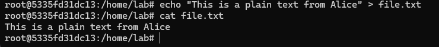
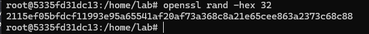
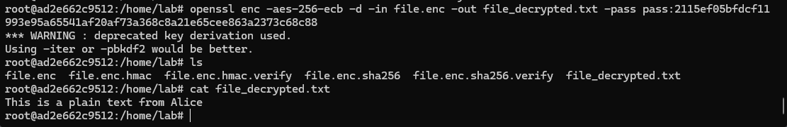
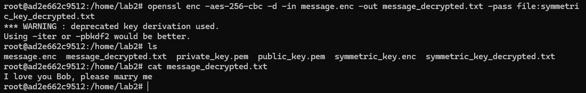
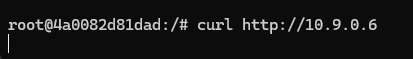

# Task 1: Transfer files between computers  
**Question 1**: 
Conduct transfering a single plaintext file between 2 computers, 
Using openssl to implementing measures manually to ensure file integerity and authenticity at sending side, 
then veryfing at receiving side. 

**Answer 1**:

## Step 1: Set up environment

I will use the lab from `https://github.com/quang-ute/Security-labs/tree/main/Network/ping-pong` to set up environment

```sh
docker-compose up -d
```

In this lab, it has 2 user
- bob-10.9.0.6
- alice-10.9.0.5

Make sure all utilities are ready for the lab.

```sh
apt update
apt install sudo
apt install openssh-server
apt install openssh-client
```

Use the code below to run ssh service

```sh
service ssh start
```

or 

```sh
sudo systemctl start ssh
```


Checking if it's running

```sh
service ssh status
```


## Step 2: Alice container

Access Alice terminal

```sh
docker exec -it alice-10.9.0.5 /bin/bash
```

1. Fisrtly, I will create a plain text with the name `file.txt`

```sh
echo "This is a plain text from Alice" > file.txt
```



2. Generate a new private key

```sh
openssl rand -hex 32
```



Private key:
`2115ef05bfdcf11993e95a65541af20af73a368c8a21e65cee863a2373c68c88`

3. Encrypt file with the AES-256-ECB symmetric encryption algorithm

```sh
openssl enc -aes-256-ecb -in file.txt -out file.enc -pass pass:2115ef05bfdcf11993e95a65541af20af73a368c8a21e65cee863a2373c68c88
```

- The `enc` (encryption) command within the OpenSSL toolkit.
- `-aes-256-ecb`: Advanced Encryption Standard - 256-bit key size - Electronic Codebook mode.
- The input file to encrypt. In this case, the file is named `file.txt`.
- `-out file.enc` Specifies the output file for the encrypted data, named `file.enc`.
- The passphrase used to derive the encryption key. The passphrase is `2115ef05bfdcf119.......`

4. Create a SHA-256 hash of the file `file.enc`

```sh
openssl dgst -sha256 -binary file.enc > file.enc.sha256
```

Calculate a SHA-256 hash of the encrypted file (`file.enc`) and output the hash in binary format to a separate file (`file.enc.sha256`).


5. Generate HMAC(Hash-based Message Authentication Code)

HMAC (Hash-based Message Authentication Code) ensures the authenticity and integrity of the transferred file.

We create it with shared secret key

```sh
openssl dgst -sha256 -hmac "2115ef05bfdcf11993e95a65541af20af73a368c8a21e65cee863a2373c68c88" -binary file.enc.sha256 > file.enc.hmac
```


After all these steps, we have 4 file
- file.enc  
- file.enc.hmac  
- file.enc.sha256  
- file.txt


## Step 3: Bob container

Access Bob terminal

```sh
docker exec -it alice-10.9.0.5 /bin/bash
```

1. Change the passwd

```sh
useradd -m -s /bin/bash bob
passwd bob
```

Create a new user (`bob`) on a Linux system and set a password (`bob`) for it


2. Send file

Before transfering, make sure Alice have permission to write file in folder. Add write permissions

```sh
sudo chmod ugo+w /home/lab
```

Now return to Alice's terminal and send 3 file for Bob

```sh
scp file.enc file.enc.hmac file.enc.sha256 bob@10.9.0.6:/home/lab
```


Then, look at Bob computer, we see these files in folder


3. Verifying HMAC

```sh
openssl dgst -sha256 -hmac "2115ef05bfdcf11993e95a65541af20af73a368c8a21e65cee863a2373c68c88" -binary file.enc.sha256 > file.enc.hmac.verify
```

The computed HMAC of `file.enc.sha256` (using the provided key) is written to the file `file.enc.hmac.verify`.

```sh
diff file.enc.hmac file.enc.hmac.verify
```

If the two files are identical, `diff` produces no output, indicating that the HMAC matches and the file is both authentic and unchanged.


4. Verifying hash 

```sh
openssl dgst -sha256 -binary file.enc > file.enc.sha256.verify
diff file.enc.sha256 file.enc.sha256.verify
```

Same logic with verifying HMAC


5. Decrypt the file

```sh
openssl enc -aes-256-ecb -d -in file.enc -out file_decrypted.txt -pass pass:2115ef05bfdcf11993e95a65541af20af73a368c8a21e65cee863a2373c68c88
```



# Task 2: Transfering encrypted file and decrypt it with hybrid encryption. 
**Question 1**:
Conduct transfering a file (deliberately choosen by you) between 2 computers. 
The file is symmetrically encrypted/decrypted by exchanging secret key which is encrypted using RSA. 
All steps are made manually with openssl at the terminal of each computer.

**Answer 1**:

## Scenario for Task 2
- Bob generates a public and private key pair, then shares the public key with Alice
- Alice generates a symmetric key to encrypt the file, and uses the public key to encrypt the symmetric key
- Alice sends the encrypted file and the encrypted symmetric key to Bob
- Bob uses the private key to encrypt the symmetric key, then uses the symmetric key to encrypt the file

## Step 1: Bob generates key pair

1. Generate RSA Key Pair

```sh
openssl genrsa -out private_key.pem 2048
```

generate a 2048-bit RSA private key and store it securely in the `private_key.pem` file.


2. Generate Public Key

```sh
openssl rsa -in private_key.pem -pubout -out public_key.pem
```

- `private_key.pem`: Bob's private key (keep secure).
- `public_key.pem`: Bob's public key (shared with Alice).


3. Send Bob's public key to Alice

Firstly, we access to Alice's computer and change password of Alice to `alice`

```sh
useradd -m -s /bin/bash alice
passwd alice
```


After that, add write permission

```sh
sudo chmod ugo+w /home/lab2
```


Finally, return to Bob's terminal and use `scp` to send public key to Alice

```sh
scp public_key.pem alice@10.9.0.5:/home/lab2
```


`ls` in Alice computer to check if Alice receive the key


## Step 2: Alice prepares the file for sending

1. Create a plain message

```sh
echo "I love you Bob, please marry me" > message.txt
```


2. Generate a Random Symmetric Key (AES)

```sh
openssl rand -hex 32 > symmetric_key.txt
```


3. Encrypt the file using AES-256-CBC

```sh
openssl enc -aes-256-cbc -in message.txt -out message.enc -pass file:symmetric_key.txt
```

Encrypt a file named `message.txt` using the AES-256-CBC encryption algorithm and save the encrypted result to a file named `message.enc`.


```sh
openssl rsautl -encrypt -inkey public_key.pem -pubin -in symmetric_key.txt -out symmetric_key.enc
```

Encrypt a symmetric key using a public key.


4. Send encrypted files to Bob

Before that, add write permission in Bob's folder

```sh
sudo chmod ugo+w /home/lab2
```


```sh
scp message.enc symmetric_key.enc bob@10.9.0.6:/home/lab2
```


## Step 3: Bob decrypts the files

Ensures that Bob receive `message.enc` and `symmetric_key.enc`


1. Decrypt the symmetric key using Bob's private key

```sh
openssl rsautl -decrypt -inkey private_key.pem -in symmetric_key.enc -out symmetric_key_decrypted.txt
```

- `openssl rsautl -decrypt`: the RSA utility in OpenSSL to perform decryption.
- `-inkey private_key.pem`: the private key file to use for decryption.
- `-in symmetric_key.enc`: the file containing the encrypted symmetric key.
- `-out symmetric_key_decrypted.txt`: the output file for the decrypted symmetric key.


2. Decrypt the file using the symmetric key

```sh
openssl enc -aes-256-cbc -d -in message.enc -out message_decrypted.txt -pass file:symmetric_key_decrypted.txt
```

- `-aes-256-cbc`: the encryption/decryption algorithm to use, which is Advanced Encryption Standard (AES) with a 256-bit key size in Cipher Block Chaining (CBC) mode.
- `-d`: This flag indicates that we want to perform decryption.
- `-in message.enc`: the input file containing the encrypted data.
- `-out message_decrypted.txt`: the output file for the decrypted data.
- `-pass file:symmetric_key_decrypted.txt`: the file containing the symmetric key used for decryption.



# Task 3: Firewall configuration
**Question 1**:
From VMs of previous tasks, install iptables and configure one of the 2 VMs as a web and ssh server. Demonstrate your ability to block/unblock http, icmp, ssh requests from the other host.

**Answer 1**:

## Step 1: Set up environment

1. Configure docker

In this lab, we have 2 user
- Alice for client
- Bob for Web and SSH service

Make sure both Alice and Bob have iptables for the tasks

```sh
apt update
apt install iptables
```

Checking if they have iptables.


- Alice


- Bob


Additionally, include the `cap_add` option in the `docker-compose.yml` file to grant the necessary permissions for running iptables.


Now we have to rebuild docker with recent update.

```sh
docker-compose build
docker-compose up -d
```

2. Configure bob as a web and SSH server

Now we will install apache2 and ssh on Bob's computer and run these services

```sh
apt update
apt install openssh-server
apt install openssh-client
apt install apache2
service apache2 start
service ssh start
```


Change passwd of Bob so that Alice can use ssh service for this task.

```sh
useradd -m -s /bin/bash bob
passwd bob
```

## Step 2: Configure iptables to block traffic in Bob's computer

Some helpful commands for iptables

- Monitor iptable

```sh
iptables -L -v -n
```


- Delete existed iptable

```sh
iptables -F
iptables -X 
iptables -Z
```

In this step, we will demonstrate blocking three services

- HTTP traffic (port 80)
- ICMP (ping) 
- SSH access (port 22)

1. Block HTTP access from Alice

Before configuration, Alice can access via HTTP.


Now, Let configure Bob's iptables.

```sh
iptables -A INPUT -p tcp --dport 80 -s 10.9.0.5 -j DROP
```

Creates a firewall rule that blocks all incoming TCP traffic on port `80` (HTTP) from the IP address `10.9.0.5` (Alice).


After configuration, Alice can not access via HTTP because no HTML respone is sent back to Alice.



2. Block ICMP access from Alice

Firstly, Alice successfully pings Bob.

```sh
ping 10.9.0.6
```


After that, Let configure Bob's iptables.

```sh
iptables -A INPUT -p icmp --icmp-type echo-request -s 10.9.0.5 -j DROP
```

Creates a firewall rule that blocks all incoming `ICMP` traffic from the IP address `10.9.0.5` (Alice) which ping Bob.


We see that Alice can not ping Bob now.


3. Block SSH access from Alice

Before this step, Alice can access SSH 

```sh
ssh bob@10.9.0.6
```


Let configure a rule that blocks incoming SSH traffic from `10.9.0.5` (Alice).

```sh
iptables -A INPUT -p tcp --dport 22 -s 10.9.0.5 -j DROP
```


Now Alice's access is blocked.


## Step 3: Configure iptables to unblock traffic in Bob's computer

Before unblocking


1. Unblock HTTP access from Alice

```sh
iptables -D INPUT -p tcp --dport 80 -s 10.9.0.5 -j DROP
```

Now we use option `-D` to delete this rule from INPUT chain.


Now Alice can `curl` a web from Bob.

```sh
curl http://10.9.0.6
```


2. Unblock ICMP access from Alice

With same way of previous step, we delete ICMP block rule.

```sh
iptables -D INPUT -p icmp --icmp-type echo-request -s 10.9.0.5 -j DROP
```


Let check Alice side

```sh
ping 10.9.0.6
```


3. Unblock SSH access from Alice

Delete rule

```sh
iptables -D INPUT -p tcp --dport 22 -s 10.9.0.5 -j DROP
```


Alice check SSH access

```sh
ssh bob@10.9.0.6
```

