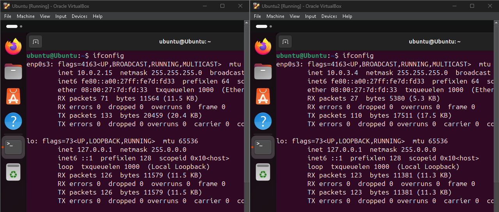
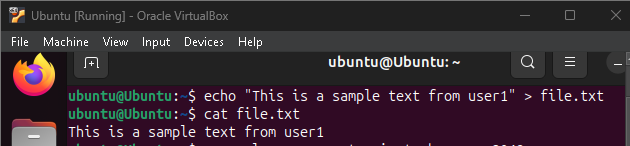
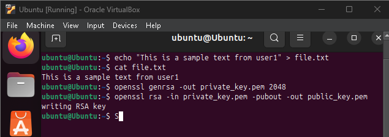

# Task 1: Transfer files between computers  
**Question 1**: 
Conduct transfering a single plaintext file between 2 computers, 
Using openssl to implementing measures manually to ensure file integerity and authenticity at sending side, 
then veryfing at receiving side. 

**Answer 1**:

***Step 1: Set up docker environment***

```sh
docker compose up -d
```



Now we see all the images we have:



In this test, I will use 
- inner-172.16.10.100 for sender
- outsider-10.9.0.5 for receiver

***Step 2: Access the sending container (inner-172.16.10.100)***
1. Use `docker exec -it inner-172.16.10.100 /bin/bash` to access sender

2. The we create sample text

```sh
echo "This is a sample message from sender" > plain.txt
```
 


3. Then we compute SHA-256 Hash of the File:

```sh
openssl dgst -sha256 plain.txt > hash.txt
```


4. Generate RSA keys

```sh
openssl genpkey -algorithm RSA -out private_key.pem
openssl rsa -pubout -in private_key.pem -out public_key.pem
```


5. Sign the hash:

```sh
openssl dgst -sha256 -sign private_key.pem -out signature.bin hash.txt
```

# Task 2: Transfering encrypted file and decrypt it with hybrid encryption. 
**Question 1**:
Conduct transfering a file (deliberately choosen by you) between 2 computers. 
The file is symmetrically encrypted/decrypted by exchanging secret key which is encrypted using RSA. 
All steps are made manually with openssl at the terminal of each computer.

**Answer 1**:


# Task 3: Firewall configuration
**Question 1**:
From VMs of previous tasks, install iptables and configure one of the 2 VMs as a web and ssh server. Demonstrate your ability to block/unblock http, icmp, ssh requests from the other host.

**Answer 1**:
***Step 1: Update docker-compose.yml***
Configure inner-172.16.10.100 as the firewall to block/unblock HTTP, ICMP, and SSH requests.
```sh
inner:
        build: 
            context: ./image
        image: base-image
        container_name: inner-172.16.10.100
        tty: true
        cap_add:
            - ALL
        networks:
            net-172.16.10.0:
                ipv4_address: 172.16.10.100
        command: bash -c "
                      ip route del default &&
                      ip route add default via 172.16.10.10 &&
                      /etc/init.d/openbsd-inetd start &&
                      tail -f /dev/null
                 "
```
Ensure iweb-172.16.10.110 is set up as the web and SSH server.
```sh
apache1:
        build: 
            context: ./apache
        image: apache-image
        container_name: iweb-172.16.10.110
        tty: true
        cap_add:
            - ALL
        networks:
            net-172.16.10.0:
                ipv4_address: 172.16.10.110
        command: bash -c "
                      ip route del default &&
                      ip route add default via 172.16.10.10 &&
                      service ssh start &&
                      service apache2 start &&
                      tail -f /dev/null
                "
```
***Step 2: Build and run the Docker containers***
Build the Docker images and start the containers using docker-compose.
```sh
docker-compose up -d
```
***Step 3: Demonstrate blocking/unblocking HTTP, ICMP, and SSH requests***

Access the inner-172.16.10.100 container to add/remove iptables rules.

```sh
docker exec -it inner-172.16.10.100 /bin/bash
```

Then we edit iptables:

1. Block HTTP requests (port 80).

```sh
iptables -A INPUT -p tcp --dport 80 -j REJECT
```

2. Block ICMP requests (ping).

```sh
iptables -A INPUT -p icmp -j REJECT
```

3. Block SSH requests (port 22).

```sh
iptables -A INPUT -p tcp --dport 22 -j REJECT
```

4. Unblock HTTP requests (port 80).

```sh
iptables -A INPUT -p tcp --dport 80 -j ACCEPT
```

5. Unblock ICMP requests (ping).

```sh
iptables -A INPUT -p icmp -j ACCEPT
```

6. Unblock SSH requests (port 22).

```sh
iptables -A INPUT -p tcp --dport 22 -j ACCEPT
```

